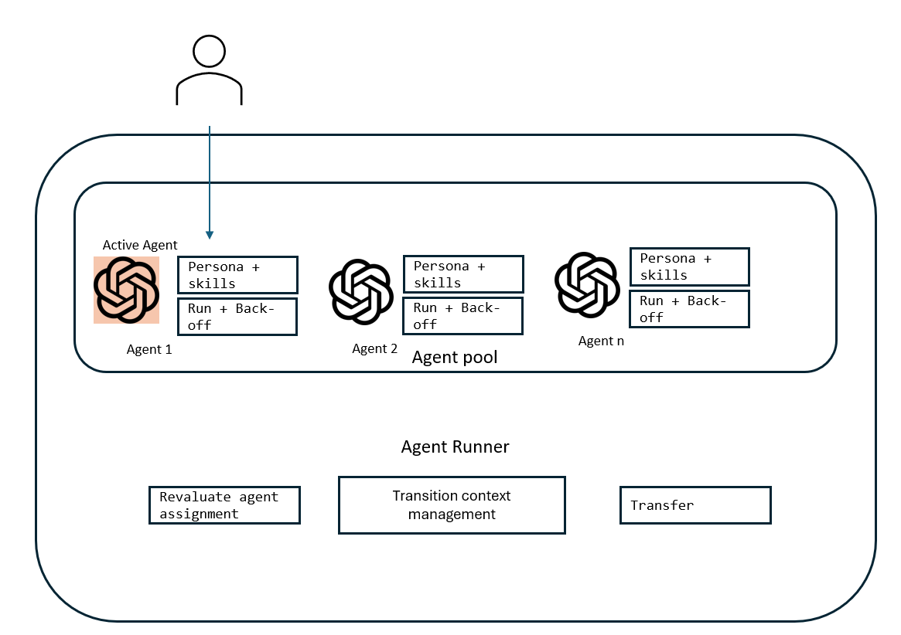
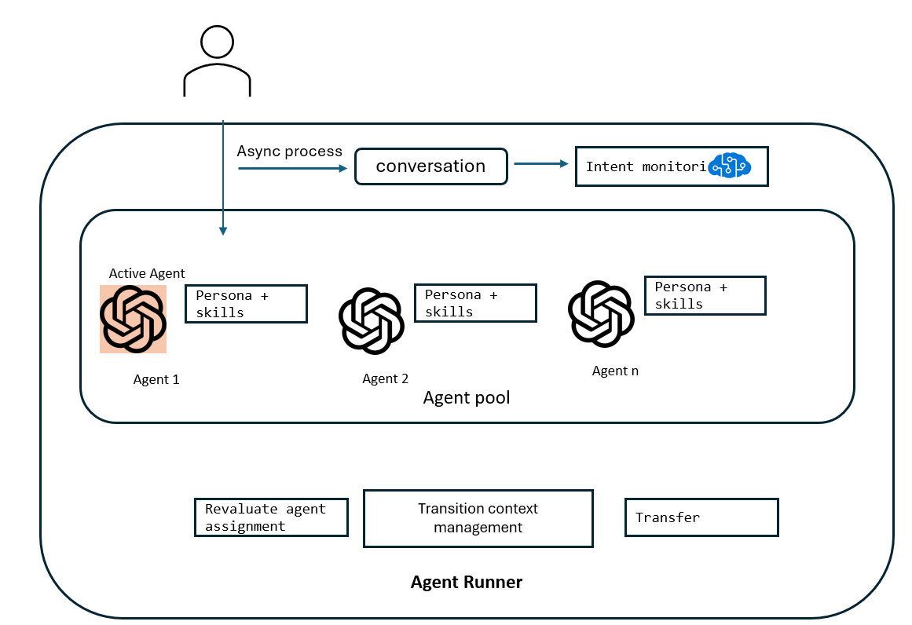

# Multi-modal & Multi-domain agent solution accelerator 
This repository contains examples of a multi-domain design to facilitate scaling across various domains. We have developed two implementations: one for text-based communication and another for voice-based communication. Both implementations address a common business scenario: customer service for flight and hotel bookings. The primary goal is to automate customer service for a travel booking agency. The customer service function assists registered customers in modifying their hotel and flight bookings, confirming reservations, and addressing inquiries about hotel and flight policies.  
  
To achieve this, we have designed two patterns to orchestrate multiple individual agents—one for the hotel domain and another for the flight domain—so they can work seamlessly together. From the customer's perspective, these agents appear as a single customer service entity. You can explore the detailed implementation and run the solutions by checking the links provided with each design pattern's description.  

### 1. Multi-Domain Agents Design 1

In this pattern, multiple domain-specific agents are orchestrated by an Agent Runner, allowing for scaling across multiple domains while maintaining the appearance of a single agent to the users. Users interact with one active agent at a time without supervision. Each agent is programmed to automatically withdraw when the conversation goes out of scope. The Agent Runner intervenes only when such a withdrawal occurs. This design pattern is implemented for the [text_agent](text_agent/README.md).  

This pattern is implemented for [text_agent](text_agent/README.md) 

### 2. Multi-Domain Agents  Design 2

Similar to the first pattern, multiple domain-specific agents are coordinated by an Agent Runner to manage multiple domains. Users interact with one active agent at a time, and the conversation is asynchronously supervised by the Agent Runner. If the conversation goes off-topic, the Agent Runner steps in and assigns the appropriate agent to continue the dialogue. This design pattern is implemented for the [voice_agent](voice_agent/README.md).  
